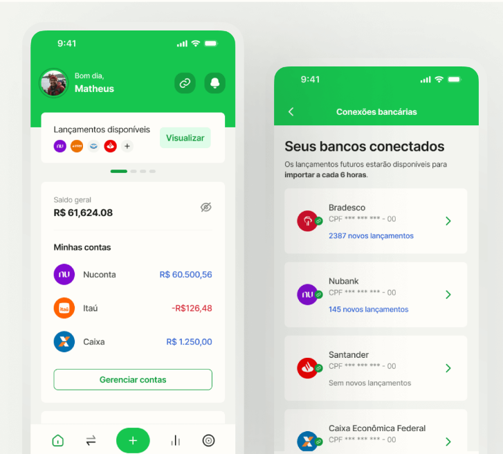
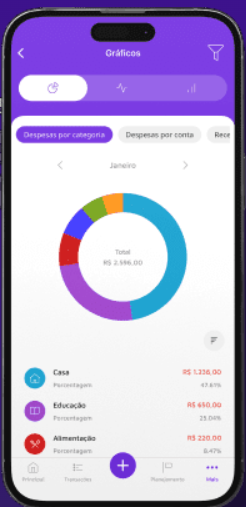

# Análise de Concorrência

A análise de concorrência tem como objetivo identificar soluções que atuam no mesmo segmento do **Gestor de Controle Financeiro Pessoal**, observando suas funcionalidades, experiência do usuário, modelos de negócio e padrões de interface.

Foram analisadas três soluções que atuam na área de controle financeiro pessoal: **Controle de Gastos do Itaú, Organizze e Mobills**.

Embora o Controle de Gastos do Itaú não seja uma aplicação exclusivamente dedicada à gestão financeira pessoal, ele foi considerado por oferecer funcionalidades semelhantes dentro do aplicativo bancário.

---

## 1. Controle de Gastos — Itaú

**Link:** [Controle de Gastos Itaú](https://www.itau.com.br/controle-de-gastos)

  
  

<em>Figuras 1 e 2 — Comparação mensal, limites por categoria e maiores gastos no Itaú.</em>

### Descrição e funcionalidades

O Controle de Gastos é integrado ao aplicativo do banco. Por já possuir acesso às movimentações da conta e cartões Itaú, grande parte das informações é registrada automaticamente.

Principais recursos:

* categorização automática dos gastos;
* alteração manual de categorias;
* limites de gastos;
* comparação entre meses;
* maiores gastos;
* barras de progresso e gráficos;
* alertas de limite.

### Experiência do usuário

O principal ponto positivo é a praticidade, pois o usuário não precisa cadastrar manualmente suas compras. A interface também é simples e utiliza cards, gráficos e categorias.

Como limitação, o recurso funciona melhor dentro do próprio ecossistema Itaú e não centraliza completamente movimentações de outras instituições.

### Preço e modelo de negócio

Não possui assinatura específica. O recurso faz parte dos serviços oferecidos aos clientes do banco.

### Pontos positivos

* cadastro automático;
* interface simples;
* boa visualização dos gastos;
* acompanhamento de limites.

### Pontos negativos

* dependência do banco;
* menor personalização;
* integração limitada com outras instituições.

---

## 2. Organizze

**Link:** [Organizze](https://www.organizze.com.br/)

  

<em>Figura 3 — Visão geral das contas e conexões bancárias no Organizze.</em>

### Descrição e funcionalidades

O Organizze é um aplicativo especializado em gestão financeira pessoal.

Principais recursos:

* receitas e despesas;
* contas e cartões;
* categorias e subcategorias;
* limites de gastos;
* relatórios e gráficos;
* lançamentos recorrentes;
* integração bancária;
* Open Finance;
* acesso pelo celular e computador.

### Experiência do usuário

O aplicativo se destaca pela interface simples e organizada, facilitando o uso por pessoas que não possuem experiência com sistemas financeiros.

Entre as críticas estão algumas limitações nos relatórios e recursos disponíveis apenas nos planos pagos.

### Preço e modelo de negócio

Funciona por assinatura, com planos pagos que variam conforme os recursos e quantidade de conexões bancárias.

### Pontos positivos

* interface limpa;
* fácil aprendizado;
* integração com diferentes bancos;
* boa organização das informações.

### Pontos negativos

* principais recursos exigem assinatura;
* algumas limitações de relatórios;
* diferenças entre versão Web e aplicativo.

---

## 3. Mobills

**Link:** [Mobills](https://www.mobills.com.br/)

  

<em>Figura 4 — Distribuição das despesas por categoria no Mobills.</em>

### Descrição e funcionalidades

O Mobills é uma plataforma de controle financeiro pessoal com foco em planejamento e acompanhamento detalhado das finanças.

Principais recursos:

* receitas e despesas;
* contas e cartões;
* categorias;
* orçamento mensal;
* metas financeiras;
* integração bancária;
* gráficos e relatórios;
* contas a pagar;
* versão Web e aplicativo.

### Experiência do usuário

O Mobills possui grande quantidade de funcionalidades e informações financeiras.

Isso é uma vantagem para usuários que desejam um controle completo, porém pode deixar a interface mais complexa para quem está utilizando o sistema pela primeira vez.

### Preço e modelo de negócio

Possui modelo **freemium**, com versão gratuita e planos pagos que liberam funcionalidades avançadas.

### Pontos positivos

* muitos recursos;
* relatórios completos;
* planejamento financeiro;
* metas;
* integração bancária.

### Pontos negativos

* interface mais complexa;
* várias funções são pagas;
* curva de aprendizado maior.

---

## 4. Comparação

| Característica      |   Itaú   | Organizze | Mobills |
| ------------------- | :------: | :-------: | :-----: |
| Controle de gastos  |     ✅    |     ✅     |    ✅    |
| Categorias          |     ✅    |     ✅     |    ✅    |
| Limites de gastos   |     ✅    |     ✅     |    ✅    |
| Gráficos            |     ✅    |     ✅     |    ✅    |
| Controle de cartões |   Itaú   |     ✅     |    ✅    |
| Vários bancos       | Limitado |     ✅     |    ✅    |
| Inserção manual     | Limitada |     ✅     |    ✅    |
| Integração bancária |     ✅    |     ✅     |    ✅    |
| Metas financeiras   | Limitado |  Parcial  |    ✅    |
| Versão Web          |     —    |     ✅     |    ✅    |

---

## 5. Padrões e tendências

A análise dos concorrentes mostrou alguns padrões comuns no mercado:

* uso de **categorias de gastos**;
* dashboards com informações resumidas;
* gráficos e barras de progresso;
* comparação entre períodos;
* limites mensais;
* integração automática com bancos;
* uso de cards para organizar informações;
* redução da necessidade de lançamento manual;
* centralização de contas e cartões.

---

## 6. Resumo dos resultados

| Concorrente | Principal vantagem     | Principal limitação  |
| ----------- | ---------------------- | -------------------- |
| Itaú        | Automatização          | Dependência do banco |
| Organizze   | Simplicidade           | Recursos pagos       |
| Mobills     | Quantidade de recursos | Maior complexidade   |

---

## 7. Recomendações

Para o **Gestor de Controle Financeiro Pessoal**, recomenda-se utilizar os melhores elementos observados nos concorrentes:

* interface simples semelhante ao **Itaú e Organizze**;
* dashboard com receitas, despesas e saldo;
* categorias personalizáveis;
* gráficos;
* comparação entre meses;
* limites de gastos;
* ranking das maiores despesas;
* controle de contas e cartões;
* metas financeiras semelhantes às oferecidas pelo **Mobills**.

A proposta é criar uma solução que mantenha a **simplicidade de uso**, mas ofereça recursos suficientes para um controle financeiro completo, evitando uma interface excessivamente carregada.
