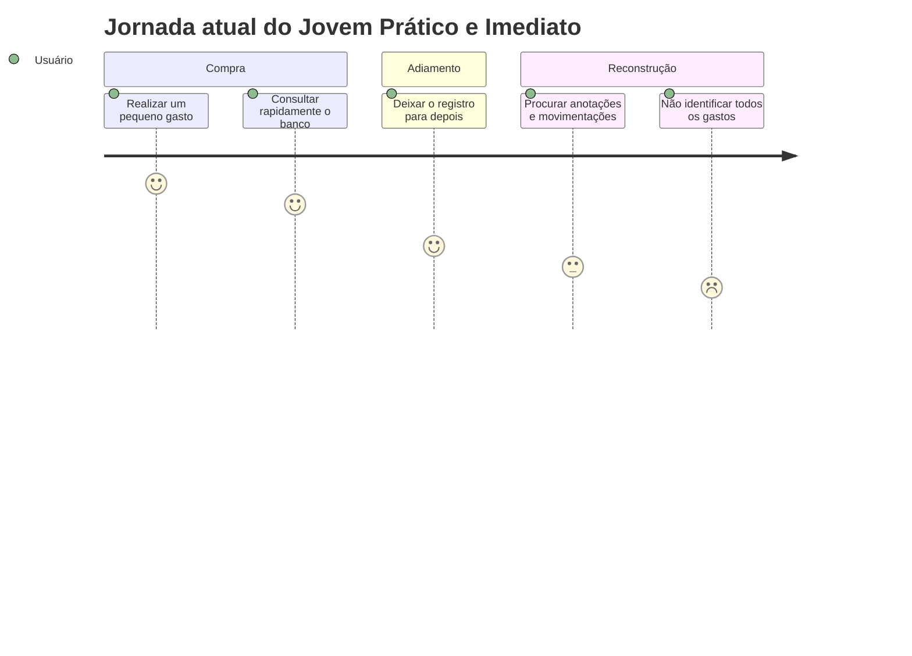
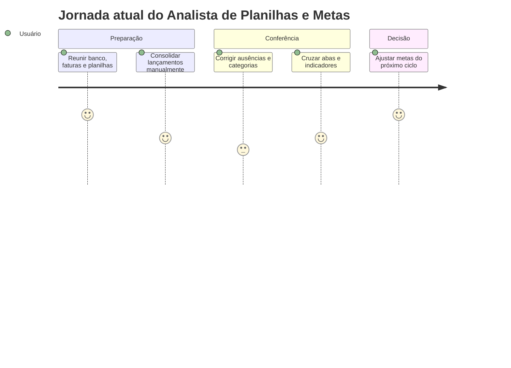
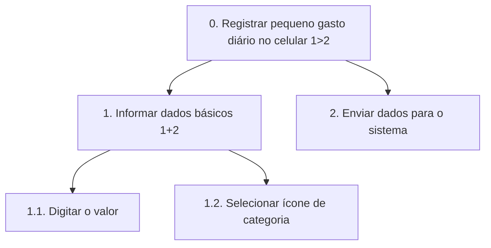
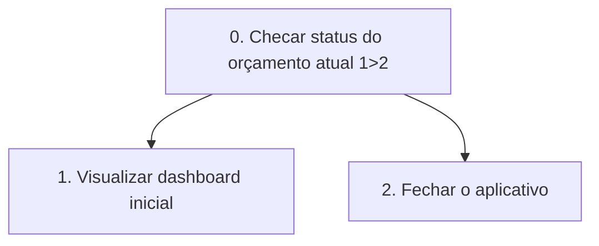
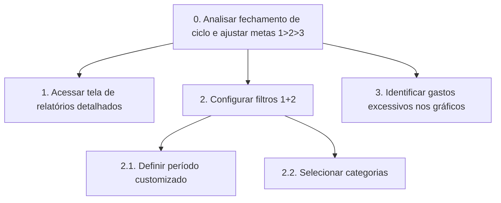

# Cenários de Análise e Jornadas Atuais

## Persona 1 — O Jovem Prático e Imediato

### 1. Cenário de análise/problema

Depois de comprar um lanche na cantina, o jovem guarda o comprovante e segue para a aula. Na volta para casa, consulta o saldo pelo aplicativo do banco enquanto está no transporte público, mas não consegue identificar rapidamente quanto já gastou com alimentação. Pensa em registrar o valor no bloco de notas, porém está em pé, cercado por ruído, distrações e movimento. Decide deixar para depois. Ao fim da semana, encontra anotações incompletas, não se lembra de todas as compras pequenas e percebe que o saldo está menor do que esperava.

### 2. Questões de refinamento

- Com que frequência pequenos gastos deixam de ser registrados?
- Quanto tempo depois da compra o usuário normalmente tenta organizar os dados?
- Quais categorias são mais esquecidas?
- O usuário confere notificações ou comprovantes para reconstruir os gastos?
- Quais condições tornam o registro rápido o bastante para não ser abandonado?

### 3. Refinamento do cenário

O jovem abandona o registro financeiro sempre que a tarefa exige mais do que alguns segundos de atenção. Por utilizar o celular quase exclusivamente em trânsito (no ônibus ou caminhando pelo campus), a fricção de abrir um aplicativo, fazer login e navegar por menus faz com que ele adie a anotação para "quando chegar em casa". Como a memória falha e os comprovantes são perdidos, ele chega ao fim do mês sem saber para onde o dinheiro foi, gerando ansiedade e sensação de descontrole. O problema central é a ausência de um método de captura quase instantâneo (como um widget de um clique) adaptado à sua rotina acelerada.

### 4. Contexto de uso

- Uso predominantemente em smartphone e em movimento.
- Situações comuns: transporte público, caminhada pelo campus e retorno das aulas no período noturno.
- Ambiente com solavancos, ruído, iluminação variável e muitas distrações.
- Atenção limitada e possibilidade de usar apenas uma mão.
- Necessidade de concluir uma interação em poucos segundos.

### 5. Jornada atual

| Etapa | Ação atual | Pensamento ou emoção |
| :--- | :--- | :--- |
| 1. Realiza a compra | Paga um gasto pequeno durante a rotina. | Neutro; concentrado na atividade imediata. |
| 2. Tenta acompanhar | Consulta rapidamente o saldo ou a fatura no banco. | Pressa e dúvida sobre o total já gasto. |
| 3. Adia o registro | Considera anotar o gasto, mas a situação dificulta digitar e organizar. | Leve aversão e impaciência. |
| 4. Tenta reconstruir | Mais tarde, procura anotações e movimentações bancárias. | Confusão e frustração. |
| 5. Perde visibilidade | Não consegue lembrar ou categorizar todos os pequenos gastos. | Insegurança sobre o próprio saldo. |



## Persona 2 — O Analista de Planilhas e Metas

### 1. Cenário de análise/problema

No fim de semana, o analista abre suas planilhas para fechar o ciclo financeiro. Reúne dados do aplicativo bancário, da fatura do cartão e de registros feitos ao longo do período. Antes de analisar os resultados, precisa corrigir categorias, preencher compras esquecidas e conferir lançamentos recorrentes. A manutenção manual consome tempo e torna difícil comparar ciclos que não coincidem exatamente com o mês do calendário. Quando finalmente chega aos gráficos, ainda precisa cruzar abas para descobrir qual categoria ultrapassou o orçamento e quais despesas podem ser reduzidas.

### 2. Questões de refinamento

- Quanto tempo é gasto consolidando e corrigindo os dados antes da análise?
- Quantas fontes e planilhas são usadas no fechamento de um ciclo?
- Como os ciclos financeiros são definidos atualmente?
- Quais indicadores orientam ajustes de metas e orçamento?
- Quais erros de categorização ou duplicidade ocorrem com mais frequência?

### 3. Refinamento do cenário

O analista perde em média duas horas nos finais de semana apenas realizando o trabalho braçal de exportar extratos, padronizar nomenclaturas de gastos e corrigir duplicidades em planilhas pesadas. A maior frustração não é a análise em si, mas a lentidão dos modelos legados para gerar gráficos que permitam cruzar dados (como evolução percentual de gastos com moradia vs. transporte). Sem flexibilidade para criar ciclos financeiros customizados (ex: do dia 5 de um mês ao dia 4 do outro), ele precisa adaptar fórmulas manualmente, o que eleva a chance de erros humanos e torna o processo exaustivo.

### 4. Contexto de uso

- Uso principal em quarto ou escritório doméstico, com computador, monitor, teclado e mouse.
- Ambiente estável, silencioso e bem iluminado.
- Momento de foco individual, frequentemente nos finais de semana.
- Sessões mais longas, dedicadas à exploração de gráficos, categorias e metas.
- Expectativa de visualizar grande volume de informações com clareza e sem lentidão.

### 5. Jornada atual

| Etapa | Ação atual | Pensamento ou emoção |
| :--- | :--- | :--- |
| 1. Reúne as fontes | Abre banco, faturas, anotações e planilhas. | Disposição para obter controle. |
| 2. Consolida lançamentos | Transfere e organiza os dados manualmente. | Concentração, seguida de cansaço. |
| 3. Corrige inconsistências | Procura compras ausentes, duplicadas ou mal categorizadas. | Frustração e dúvida. |
| 4. Cruza indicadores | Navega por abas e gráficos para identificar excessos. | Esforço analítico elevado. |
| 5. Ajusta metas | Decide mudanças para o próximo ciclo com os dados disponíveis. | Alívio parcial, com incerteza sobre a qualidade dos dados. |



# Análise de Tarefas (Proposta para o novo sistema)
**Tarefa 1: Registrar um Lançamento Financeiro (Despesa/Receita)**

## Visão da Persona 1 (O Jovem Prático e Imediato): Foco em Rapidez Mobile

* HTA (Análise Hierárquica de Tarefas):



* CMN-GOMS:

        GOAL 0: Registrar despesa diária
        
        METHOD 1: Cadastro rápido via widget/atalho mobile
        
            OP 1.1: Tocar no widget de nova despesa na tela inicial do celular
            
            OP 1.2: Digitar o valor numérico
            
            OP 1.3: Tocar no ícone visual correspondente à categoria (ex: alimentação)
            
            OP 1.4: Tocar em confirmar

* CTT (ConcurTaskTrees):

        (Abstrata) Registrar Gasto >> (Interativa) Inserir Valor numérico ||| (Interativa) Selecionar Categoria visual >> (Sistema) Gravar Gasto instantaneamente.

## Visão da Persona 2 (O Analista de Planilhas): Foco em Detalhamento Desktop

* HTA (Análise Hierárquica de Tarefas):

````mermaid
    graph TD
    A[0. Registrar despesa detalhada no computador 1>2] --> B[1. Preencher formulário completo 1+2+3]
    A --> C[2. Confirmar o cadastramento]
    B --> D[1.1. Inserir valor e data específica]
    B --> E[1.2. Selecionar categoria e subcategoria]
    B --> F[1.3. Adicionar tags ou observações]
````

* CMN-GOMS:

    GOAL 0: Registrar despesa detalhada

    METHOD 1: Cadastro completo via dashboard web

        OP 1.1: Clicar no botão "Novo Lançamento" no menu

        OP 1.2: Digitar o valor e alterar a data no calendário

        OP 1.3: Selecionar categoria e subcategoria no menu suspenso

        OP 1.4: Digitar tags de controle personalizadas

        OP 1.5: Clicar em "Salvar"
        
* CTT (ConcurTaskTrees):

      (Interativa) Abrir formulário web >> (Interativa) Preencher dados financeiros base [] (Interativa) Adicionar tags opcionais >> (Sistema) Validar e Salvar.
  
---

**Tarefa 2: Analisar o Ciclo Financeiro e Relatórios**

## Visão da Persona 1 (O Jovem Prático e Imediato): Foco em Resumo Visual

* HTA (Análise Hierárquica de Tarefas):

* CMN-GOMS:

        GOAL 0: Descobrir quanto de dinheiro resta no mês

        METHOD 1: Consulta de visão geral

            OP 1.1: Abrir o aplicativo móvel

            OP 1.2: Examinar o gráfico de pizza ou barra de progresso na tela inicial
        
* CTT (ConcurTaskTrees):

        (Usuário) Decidir checar o saldo >> (Interativa) Abrir o aplicativo >> (Sistema) Processar e exibir dashboard resumido >> (Usuário) Avaliar limite.
  

## Visão da Persona 2 (O Analista de Planilhas): Foco em Cruzamento de Metas

* HTA (Análise Hierárquica de Tarefas):



* CMN-GOMS:

        GOAL 0: Analisar oportunidades de otimização de gastos

        METHOD 1: Cruzamento de indicadores

            OP 1.1: Clicar no menu "Relatórios Avançados"

            OP 1.2: Selecionar período customizado no calendário

            OP 1.3: Clicar em "Gerar Gráfico"

            OP 1.4: Examinar proporções do gráfico

            OP 1.5: Extrair insights para o próximo mês

* CTT (ConcurTaskTrees):
  
        (Interativa) Acessar painel de relatórios >> (Interativa) Aplicar filtros customizados >> (Sistema) Gerar gráficos complexos >> (Usuário) Analisar oportunidades de economia.
