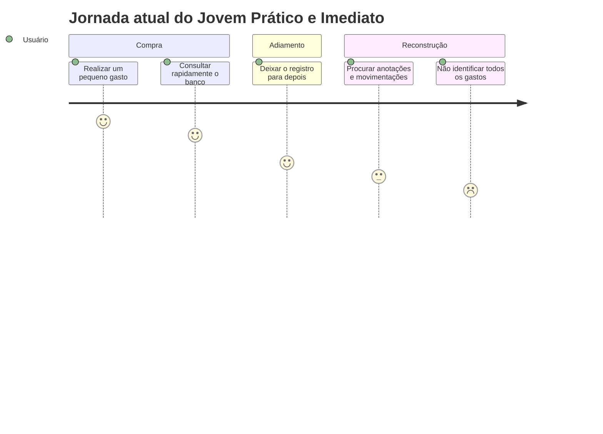
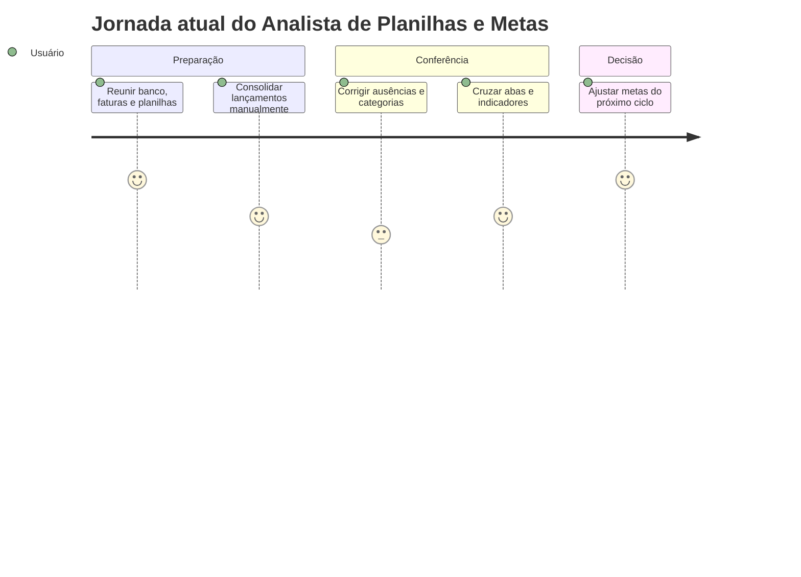

# Cenários de Análise e Jornadas Atuais

> **Status:** versão preliminar. Os cenários descrevem o problema atual, antes da existência da solução. Detalhes ainda não sustentados pelos dados foram mantidos como questões de refinamento.

## Persona 1 — O Jovem Prático e Imediato

### 1. Cenário de análise/problema

Depois de comprar um lanche na cantina, o jovem guarda o comprovante e segue para a aula. Na volta para casa, consulta o saldo pelo aplicativo do banco enquanto está no transporte público, mas não consegue identificar rapidamente quanto já gastou com alimentação. Pensa em registrar o valor no bloco de notas, porém está em pé, cercado por ruído, distrações e movimento. Decide deixar para depois. Ao fim da semana, encontra anotações incompletas, não se lembra de todas as compras pequenas e percebe que o saldo está menor do que esperava.

### 2. Questões de refinamento

- Com que frequência pequenos gastos deixam de ser registrados?
- Quanto tempo depois da compra o usuário normalmente tenta organizar os dados?
- Quais categorias são mais esquecidas?
- O usuário confere notificações ou comprovantes para reconstruir os gastos?
- Quais condições tornam o registro rápido o bastante para não ser abandonado?

### 3. Refinamento do cenário

> **Implementação futura:** será escrito após entrevistas ou observações responderem às questões acima.

### 4. Contexto de uso

- Uso predominantemente em smartphone e em movimento.
- Situações comuns: transporte público, caminhada pelo campus e retorno das aulas no período noturno.
- Ambiente com solavancos, ruído, iluminação variável e muitas distrações.
- Atenção limitada e possibilidade de usar apenas uma mão.
- Necessidade de concluir uma interação em poucos segundos.

### 5. Jornada atual

| Etapa | Ação atual | Pensamento ou emoção |
| :--- | :--- | :--- |
| 1. Realiza a compra | Paga um gasto pequeno durante a rotina. | Neutro; concentrado na atividade imediata. |
| 2. Tenta acompanhar | Consulta rapidamente o saldo ou a fatura no banco. | Pressa e dúvida sobre o total já gasto. |
| 3. Adia o registro | Considera anotar o gasto, mas a situação dificulta digitar e organizar. | Leve aversão e impaciência. |
| 4. Tenta reconstruir | Mais tarde, procura anotações e movimentações bancárias. | Confusão e frustração. |
| 5. Perde visibilidade | Não consegue lembrar ou categorizar todos os pequenos gastos. | Insegurança sobre o próprio saldo. |

## Persona 2 — O Analista de Planilhas e Metas

### 1. Cenário de análise/problema

No fim de semana, o analista abre suas planilhas para fechar o ciclo financeiro. Reúne dados do aplicativo bancário, da fatura do cartão e de registros feitos ao longo do período. Antes de analisar os resultados, precisa corrigir categorias, preencher compras esquecidas e conferir lançamentos recorrentes. A manutenção manual consome tempo e torna difícil comparar ciclos que não coincidem exatamente com o mês do calendário. Quando finalmente chega aos gráficos, ainda precisa cruzar abas para descobrir qual categoria ultrapassou o orçamento e quais despesas podem ser reduzidas.

### 2. Questões de refinamento

- Quanto tempo é gasto consolidando e corrigindo os dados antes da análise?
- Quantas fontes e planilhas são usadas no fechamento de um ciclo?
- Como os ciclos financeiros são definidos atualmente?
- Quais indicadores orientam ajustes de metas e orçamento?
- Quais erros de categorização ou duplicidade ocorrem com mais frequência?

### 3. Refinamento do cenário

> **Implementação futura:** será escrito após a validação das questões de refinamento com usuários representativos.

### 4. Contexto de uso

- Uso principal em quarto ou escritório doméstico, com computador, monitor, teclado e mouse.
- Ambiente estável, silencioso e bem iluminado.
- Momento de foco individual, frequentemente nos finais de semana.
- Sessões mais longas, dedicadas à exploração de gráficos, categorias e metas.
- Expectativa de visualizar grande volume de informações com clareza e sem lentidão.

### 5. Jornada atual

| Etapa | Ação atual | Pensamento ou emoção |
| :--- | :--- | :--- |
| 1. Reúne as fontes | Abre banco, faturas, anotações e planilhas. | Disposição para obter controle. |
| 2. Consolida lançamentos | Transfere e organiza os dados manualmente. | Concentração, seguida de cansaço. |
| 3. Corrige inconsistências | Procura compras ausentes, duplicadas ou mal categorizadas. | Frustração e dúvida. |
| 4. Cruza indicadores | Navega por abas e gráficos para identificar excessos. | Esforço analítico elevado. |
| 5. Ajusta metas | Decide mudanças para o próximo ciclo com os dados disponíveis. | Alívio parcial, com incerteza sobre a qualidade dos dados. |

## Persona secundária — O Analógico ou Desapegado Tecnológico

> **Implementação futura:** os dados disponíveis descrevem apenas seu comportamento geral. Cenário, contexto detalhado e jornada serão elaborados depois da pesquisa para não atribuir comportamentos sem evidência.
