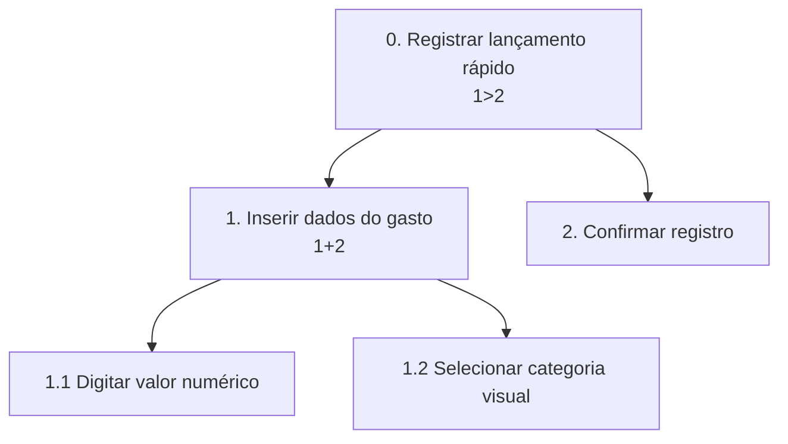
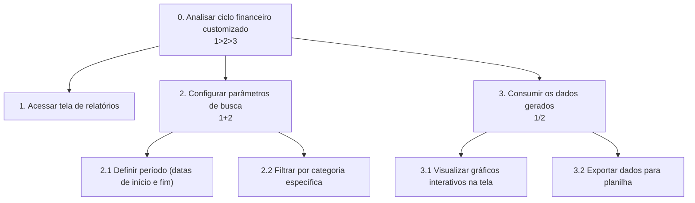

# Análise de Tarefas

### HTA 1 — Registrar um lançamento financeiro rápido

**Funcionalidade:** Permitir que o usuário insira rapidamente uma nova despesa ou receita pelo celular, com o mínimo de toques possíveis.


* Plano 0 (1>2): Inserir os dados básicos do gasto e, somente depois, confirmar o registro para envio ao sistema.
* Plano 1 (1+2): O valor numérico e o ícone de categoria podem ser informados no formulário em qualquer ordem.

### HTA 2 — Analisar ciclo financeiro customizado

Funcionalidade: Permitir que o usuário configure filtros específicos de datas e categorias para visualizar gráficos consolidados do seu ciclo financeiro e, se desejar, exportá-los.



* Plano 0 (1>2>3): Acessar a tela, em seguida configurar os parâmetros de busca e, por fim, consumir os dados gerados — rigorosamente nessa ordem.
* Plano 2 (1+2): O usuário pode definir as datas e filtrar as categorias no painel em qualquer ordem antes de gerar o relatório.
* Plano 3 (1/2): O usuário escolhe uma das opções de consumo: ou visualiza os gráficos na interface, ou clica para exportar os dados (não faz os dois simultaneamente como parte da mesma operação final).

### GOMS 1 — Editar a categoria de um gasto registrado

Funcionalidade: Permitir que o usuário corrija a categorização de uma despesa lançada erroneamente, garantindo a integridade dos relatórios.

```text
GOAL 0: alterar a categoria de um lançamento financeiro incorreto

  GOAL 1: localizar o lançamento financeiro

    METHOD 1.A: encontrar via extrato da tela inicial
    (SEL. RULE: o gasto foi registrado muito recentemente e ainda aparece nos últimos lançamentos)
      OP. 1.A.1: rolar a tela inicial até a seção "Lançamentos Recentes"
      OP. 1.A.2: identificar visualmente o lançamento desejado
      OP. 1.A.3: tocar/clicar no lançamento

    METHOD 1.B: buscar pelo histórico detalhado
    (SEL. RULE: o gasto é mais antigo ou precisa ser buscado pelo nome)
      OP. 1.B.1: tocar/clicar no menu "Extrato Completo"
      OP. 1.B.2: digitar o nome do estabelecimento na barra de busca
      OP. 1.B.3: tocar/clicar no lançamento encontrado nos resultados

  GOAL 2: editar e salvar a nova categoria
    METHOD 2.A: substituir a categoria atual
      OP. 2.A.1: tocar/clicar no botão "Editar"
      OP. 2.A.2: selecionar a nova categoria na lista suspensa
      OP. 2.A.3: tocar/clicar no botão "Salvar"
```
### GOMS 2 — Consultar limite disponível do orçamento

Funcionalidade: Permitir que o usuário consulte rapidamente quanto dinheiro ainda resta para gastar no mês, seja no Limite Mensal ou em uma categoria específica.

```text
GOAL 0: consultar o limite disponível do orçamento do mês

  GOAL 1: acessar a visão de orçamentos e limites

    METHOD 1.A: visualização rápida pelo dashboard principal
    (SEL. RULE: o usuário quer apenas saber o Limite Mensal restante)
      OP. 1.A.1: abrir o aplicativo
      OP. 1.A.2: verificar o gráfico de "Limite Mensal" no topo da tela inicial

    METHOD 1.B: visualização detalhada por categoria
    (SEL. RULE: o usuário quer saber quanto ainda pode gastar em uma categoria específica)
      OP. 1.B.1: abrir o aplicativo
      OP. 1.B.2: tocar/clicar na aba "Metas e Orçamentos" no menu inferior
      OP. 1.B.3: rolar a tela até a categoria desejada (ex: Alimentação)
      OP. 1.B.4: verificar o valor numérico de saldo disponível exibido
```
