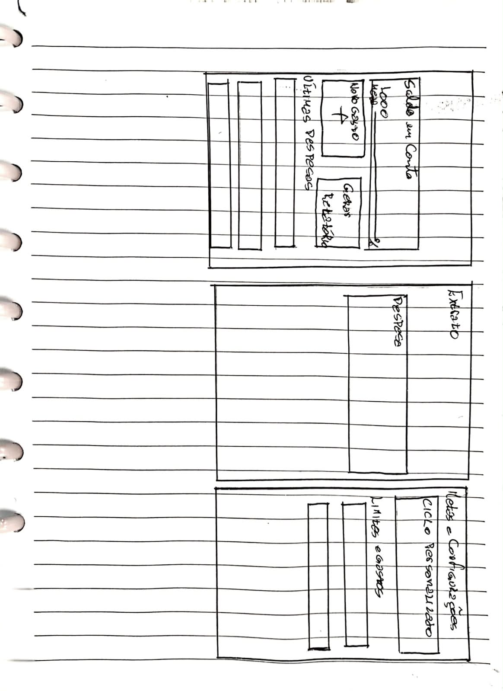

# Prototipação em Papel (Lo-fi)

O protótipo foi desenhado em papel para organizar as principais telas do Gestor de Controle Financeiro Pessoal antes da criação da versão digital.

Foram representadas três telas:

- **Início:** saldo em conta, novo gasto, geração de relatório e últimas despesas.
- **Extrato:** consulta das despesas registradas.
- **Metas e configurações:** ciclo personalizado e limites de gastos.

*Contribuições para o desenvolvimento*
A prototipação em papel estabeleceu uma referência visual para a continuidade do projeto. As três telas representadas servem como base para detalhar os componentes da interface e desenvolver um protótipo digital interativo. Com a aceitação positiva registrada, a estrutura proposta poderá orientar essa evolução, sendo refinada conforme as necessidades identificadas nas próximas avaliações.

Todas as avaliações recebidas foram positivas, indicando uma boa aceitação da proposta. O esboço servirá como base para o desenvolvimento das telas digitais.

*Figura 1 – Protótipo em papel do sistema. Fonte: elaboração própria (2026).*
